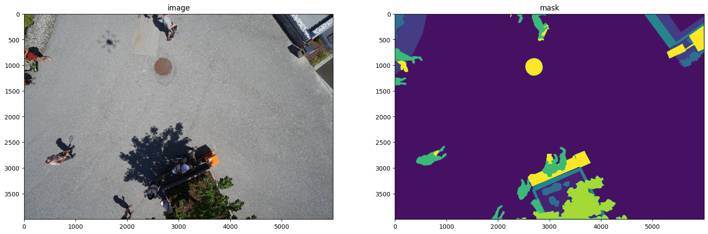
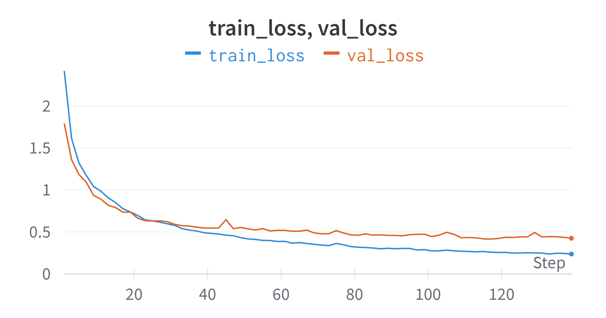

# Drone image segmentation 🚁
Semantic segmentation of high-res aerial drone images
## Stack of technologies 🏗
- Python 🐍
- PyTorch 🔥
- SMP 🔍
- OpenCV 📷
- Albumentations 🖼️
- Wandb 📊
## Task description 📋
For each image from the drone, a mask must be returned where each object is shaded in its corresponding colour. There are 23 possible object classes. 

Example:

Task is complicated by the high resolution of the images (6000x4000) and strong imbalance of classes in the dataset:

## Proposed solution 💡
For this task U-net model with efficientnet-b1 backbone was fine-tuned. 

The model was trained for 70 epochs. Final quality on validation:
- 0.558 mIoU (macro) 

Quality on validation set during training:

Train/Val loss during training:

## Prediction examples 🎯
Segmentation example after 5th epoch (middle - ground truth mask, right - predicted):

Segmentation example after 35th epoch (middle - ground truth mask, right - predicted):

Segmentation example after 70th epoch (middle - ground truth mask, right - predicted):

## How to improve 🔨
1. Longer training as well as hyperparameters optimization can significantly improve the quality of the final model
2. The U-net architecture is rather obsolete and rarely used in modern solutions. The use of newer architectures will give much more sustainable results
